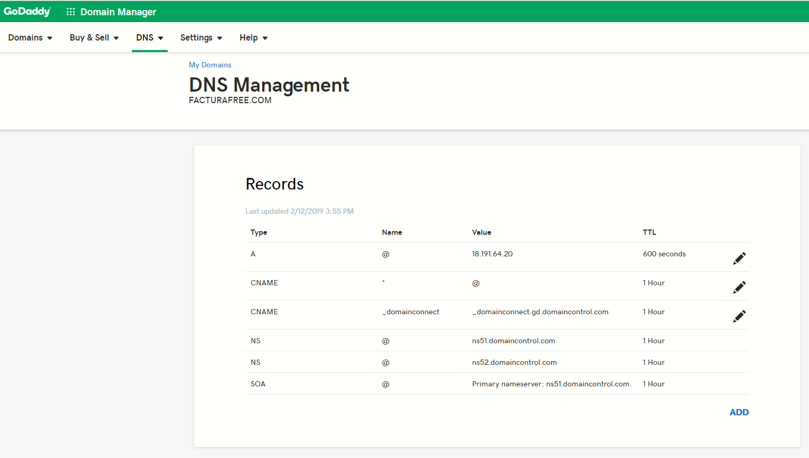

# Manual para Script de Instalación Docker | GitLab | Opción SSL | Opción SSH Facturador PRO4

## Descripción

Hemos elaborado un script para uso en instancias Linux con Ubuntu 18 o superior. Este archivo actualiza el sistema, instala las herramientas, sus dependencias y realiza todas las configuraciones previas, dejando el aplicativo listo para probar en menos de 20 minutos (siempre y cuando el dominio ya esté configurado hacia la instancia). Su ejecución es muy sencilla.

## Requisitos previos

1. Tener acceso a su servidor, vps, máquina virtual o local via SSH, en las instalaciones que realizamos para AWS o Google Cloud, hacemos entrega del usuario,
   la IP del servidor y la clave ssh que puede ser un archivo .ppk o .pem, recuerde almacenarlas en su equipo local.
2. Tener instalado una versión de ssh en su máquina para conectarse de manera remota, puede utilizar putty, filezilla o una consola terminal. 
   para mayor información sobre el acceso SSH visite los siguientes manuales:
- [guía para acceder con Putty ](https://docs.google.com/document/d/1PmQejvNd_dkXVm8DPUYlQTag0wvES46tMpxX3MPhkNY/edit#)(gestión de servidor)
- [guía para acceder con Winscp ](https://docs.google.com/document/d/1Xpri2102N4b5C-dG-FVPXW5ZWjEz5S4iDjpvl7Zwq2E/edit##)(gestión de archivos con aplicación de escritorio)
3. Si es posible configurar su dominio apuntando a su instancia para que al finalizar la instalación se encuentre disponible el aplicativo. Edite los récords A y CNAME donde A debe contener su IP y CNAME el valor * (asterisco) para que se tomen los subdominios registrados por la herramienta.




## Pasos

1. Acceder a su instancia vía SSH.
2. Loguearse como superusuario: `sudo su`.
3. Clonar el snippet de GitLab que contiene el script: `git clone https://gitlab.com/snippets/2079063.git script`.
4. Ingresar a la carpeta clonada: `cd script`.
5. Dar permisos de ejecución al script: `chmod +x install.sh`.
6. Ejecutar el comando para iniciar el despliegue: `./install.sh [dominio]`, por ejemplo, `./install.sh facturador.pro`.

...


# alfinal
# Create a Page

Add **Markdown or React** files to `src/pages` to create a **standalone page**:

- `src/pages/index.js` → `localhost:3000/`
- `src/pages/foo.md` → `localhost:3000/foo`
- `src/pages/foo/bar.js` → `localhost:3000/foo/bar`

## Create your first React Page

Create a file at `src/pages/my-react-page.js`:

```jsx title="src/pages/my-react-page.js"
import React from 'react';
import Layout from '@theme/Layout';

export default function MyReactPage() {
  return (
    <Layout>
      <h1>My React page</h1>
      <p>This is a React page</p>
    </Layout>
  );
}
```

A new page is now available at [http://localhost:3000/my-react-page](http://localhost:3000/my-react-page).

## Create your first Markdown Page

Create a file at `src/pages/my-markdown-page.md`:

```mdx title="src/pages/my-markdown-page.md"
# My Markdown page

This is a Markdown page
```

A new page is now available at [http://localhost:3000/my-markdown-page](http://localhost:3000/my-markdown-page).
